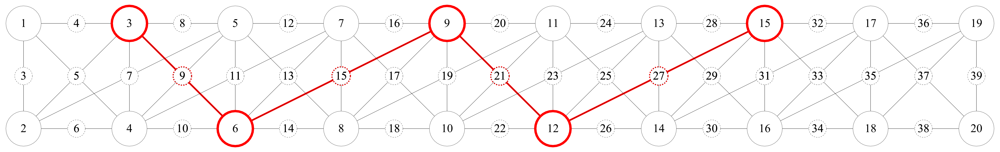
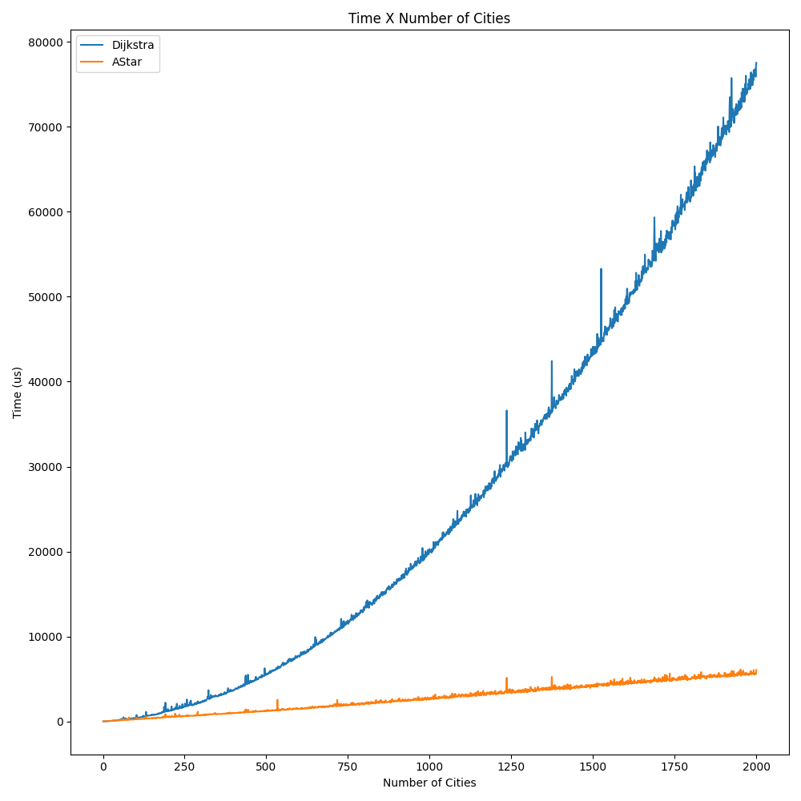
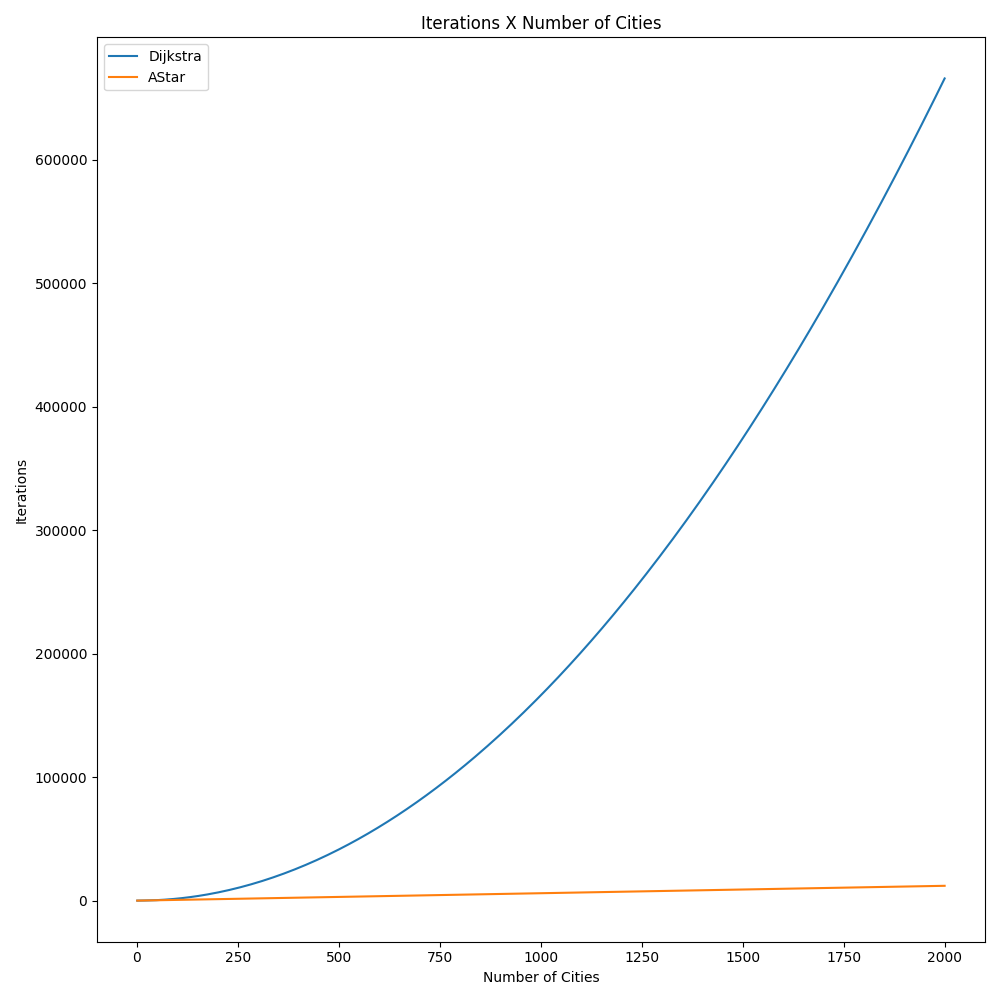
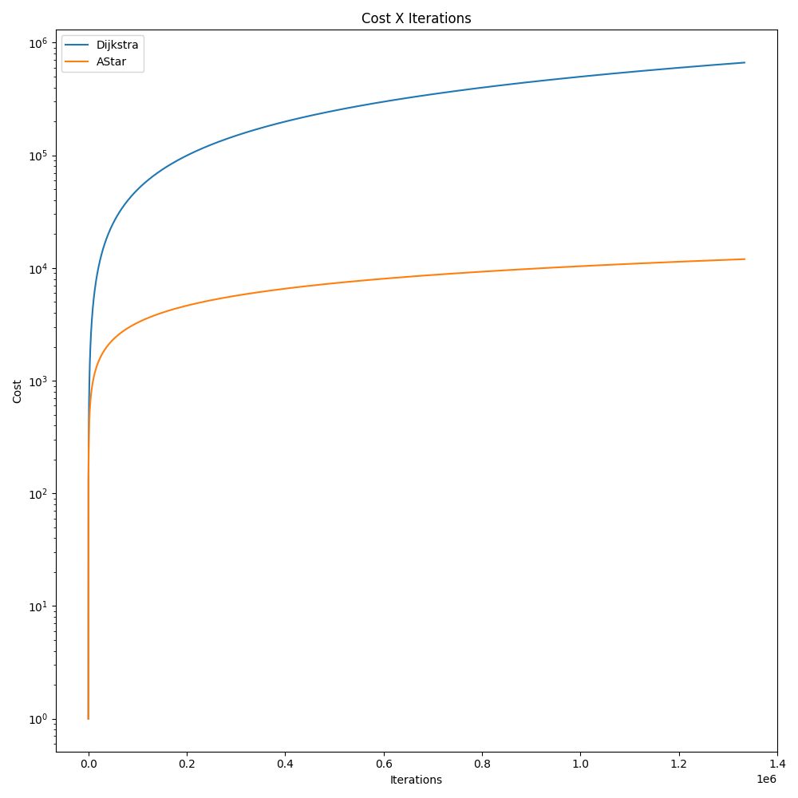

# Welcome to Shortest Path Compare Project.

This project is a simple implementation of the shortest path problem. To analyze algorithms erficiency, the project uses the following algorithms:

* 1. Dijkstra's Algorithm
* 2. A* Algorithm

# Usage
`main.py [-h] [-n NUMBER_OF_CITIES] [-c CONTINUOUSLY_GENERATE] [-st START_CITY] [-dt DESTINATION_CITY] [-s SAVE_TO_FILE] [-p PLOT_RESULTS]`

* This script is used to compare the performance of the two well-known shortest path finder algorithms.

``` bash
usage: main.py [-h] [-n NUMBER_OF_CITIES] [-c CONTINUOUSLY_GENERATE] [-st START_CITY] [-dt DESTINATION_CITY] [-v VISUALIZE_RESULTS] [-p PLOT_RESULTS]

This script is used to compare the performance of the two well-known shortest path finder algorithms.

optional arguments:
  -h, --help            show this help message and exit
  -n NUMBER_OF_CITIES, --number-of-cities NUMBER_OF_CITIES
                        The number of cities in the graph.
  -c CONTINUOUSLY_GENERATE, --continuously-generate CONTINUOUSLY_GENERATE
                        If this flag is set, the script will generate test cases continuously from 1 to N.
  -st START_CITY, --start-city START_CITY
                        The start city.
  -dt DESTINATION_CITY, --destination-city DESTINATION_CITY
                        The destination city.
  -v VISUALIZE_RESULTS, --visualize-results VISUALIZE_RESULTS
                        If this flag is set, the results will be visualized.
  -p PLOT_RESULTS, --plot-results PLOT_RESULTS
                        If this flag is set, the results will be plotted.
```

# To run the project.

* install requirements for python packages, then run one of the following python scripts:

  * Note: It is sufficient to have an anaconda environment to run though for that use following. <br/>
`conda create -n msse` <br/>
`pip install -r requirements.txt` <br/>
`conda activate msse` <br/>

* `python main.py` - runs the test suite and prints the results.
  * After an initial execution, you can also change the input parameters via run_config.json file created in the project root directory.
    * This file will be created will default values, if it does not exist or not valid. And it will be modified if user runs the script with arguments.

# See images for sample output.





